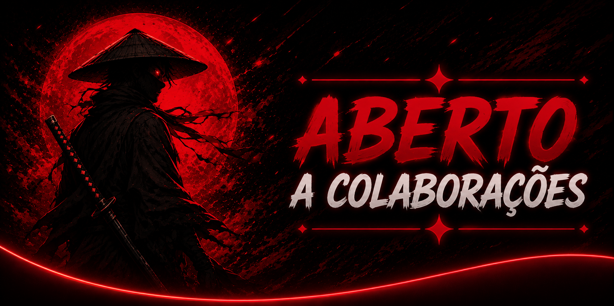

<p align="center">

</p>

<p align="center">
  
</p>

## 🎯 Sobre mim

<table>
<tr>
<td width="50%" valign="top">


```typescript
const heitor = {
    cargo: "Estudante de ADS",
    localizacao: "Goiânia - GO",

    desenvolvimento: [
        "Aplicações Java",
        "Projetos Acadêmicos"
    ],

    aprendendo: [
        "Java",
        "Banco de Dados",
        "Spring Boot",
        "REST APIs"
    ],

    tecnologias: {
        backend: ["Java"],
        banco_de_dados: ["MySQL"],
        ferramentas: ["Git", "GitHub", "VS Code"]
    }
};

```


<br>

</td>

<td width="50%" align="center">


</td>
</tr>
</table>
<!-- ==========================================
==============================================
-->

<!--                                 TECH STACK -->

<!-- ==========================================
==============================================
-->

## 📬 Contate-me

<br>
<p align="center">
<a href="https://www.linkedin.com/in/heitorzanela/">

</a>
&nbsp;
<a href="https://www.instagram.com/h.zanela">

</a>
&nbsp;
<a href="mailto:heizanela@gmail.com">

</a>
</p>
<br>

## 🛠️ Stack de Tecnologias

<p align="center">


</p>

## 📊 Estatísticas GitHub

<p align="center">
  
</p>


<picture>
  <source media="(prefers-color-scheme: dark)"
    srcset="https://raw.githubusercontent.com/hZanela/hZanela/output/pacman-contribution-graph-dark.svg">

<source media="(prefers-color-scheme: light)"
 srcset="https://raw.githubusercontent.com/hZanela/hZanela/output/pacman-contribution-graph.svg">

  
</picture>

## 📈 Gráfico de Contribuição

<p align="center">


</p>

## 📋 Visão Geral

<p align="center">
  
</p>
<br>
<p align="center">

&nbsp;&nbsp;

&nbsp;&nbsp;

</p>
<p align="center"> ⭐ <b> Conecte-se comigo </b> ⭐ </p>

<p align="center">
  <a href="https://github.com/hZanela">
    
  </a>
</p>

<p align="center">
  <i>"Aprendendo, evoluindo e transformando ideias em código, um commit de cada vez."</i> 🚀
</p>

<p align="center">
  
  &nbsp;
  <i><b>Estou sempre em busca de novos aprendizados e desafios. Se quiser trocar uma ideia sobre tecnologia ou desenvolvimento, será um prazer conversar! </b></i>
</p>

<p align="center">
  
</p>

<p align="center">

</p>
